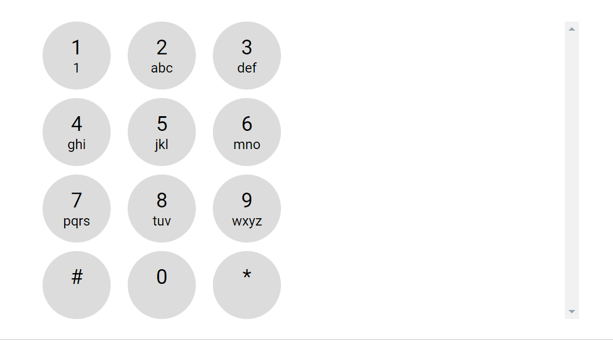
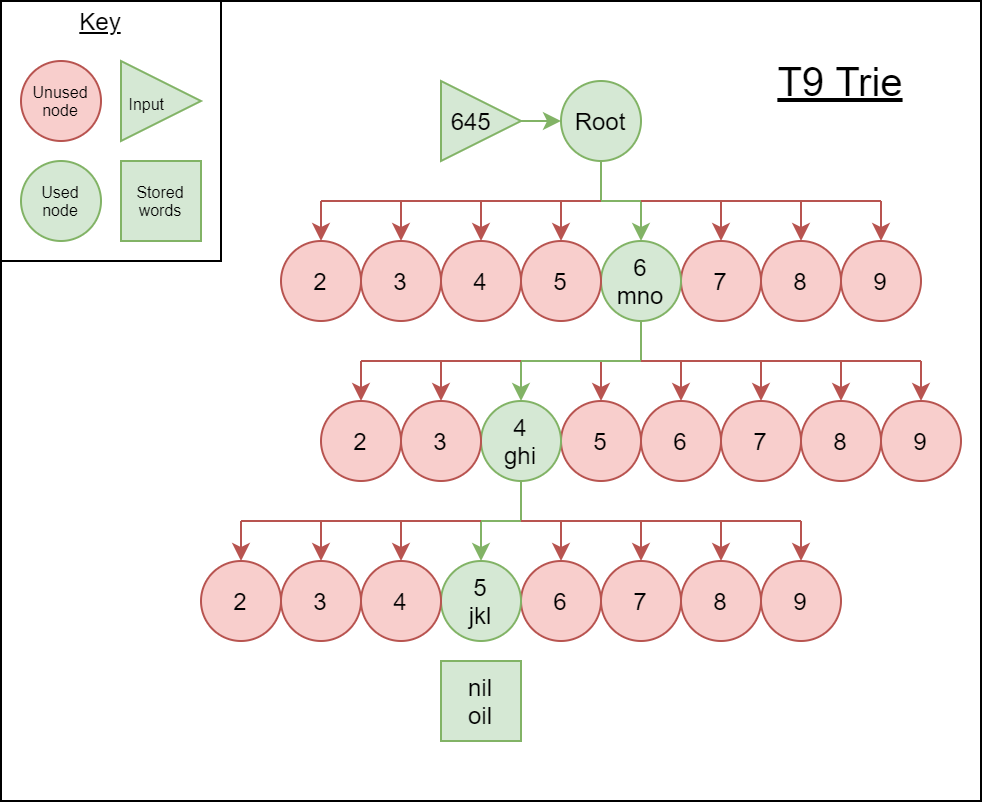
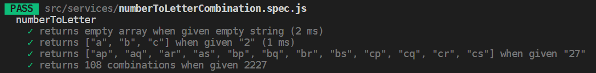
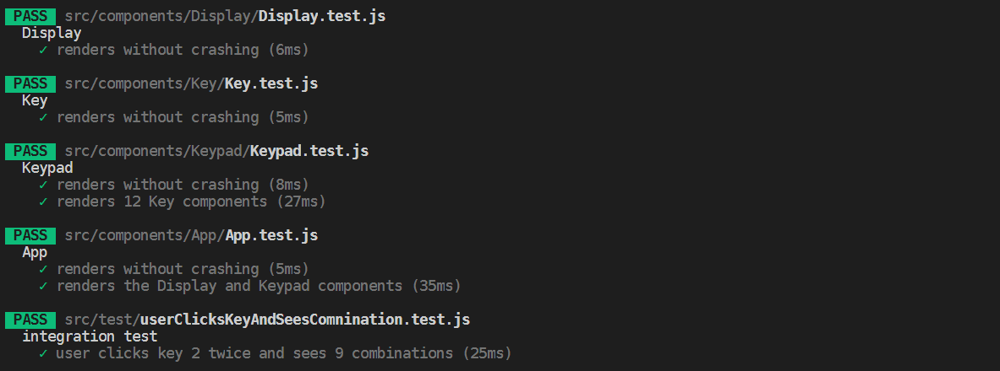
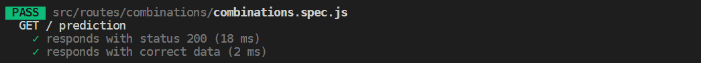

# T9

[Description](#description) | [Demo](#demo) | [Approach](#approach) | [Technologies Used](#technologies-used) | [Tests](#tests) | [Getting Started](#getting-started) | [How to Run the App](#how-to-run-the-app) | [How to Run the tests](#how-to-run-the-tests) | [TODO](#TODO)

## Description

Web app that allows users to input numbers on a keypad and returns predictive text.

## Demo

## Approach

**Basic functionality**

The basic requirement for this test was to create an algorithm that returns the combinations of letters given a keyString i.e. `'23' => ["ad", "ae", "af", "bd", "be", "bf", "cd", "ce", "cf"]'. I followed TDD for implementing this algorithm on the back end. See my initial approach [here](./predictive-text-approach.md). The problem with this is for a 7 digit key string it will need to calculate over 2000 combinations. If you combine this with dictionary filtering then you will have a very slow performing app.

**Advanced functionality - T9 Trie**

To solve the slow combination generating problem, and to implement a real word filter I decided to use a Trie. See my approach [here](./real-word-predictions.md). The Trie uses T9 keys as nodes:

The above diagram shows how two T9onyms (words that share the same key string) are stored in a Trie.

## Technologies Used

**Main technologies:**

- Suggested: Node, React, redux
- Additional: [Styled components](https://reactjs.org/): for its modular / component css that makes styling react components very easy. [Babel](https://babeljs.io/): to compiles backend code allowing modern syntax to be used throughout the project and utilization of Javascript's latest features.

**Testing:**

- Jest, Enzyme, Supertest

**Linting**

- Eslint, prettier

## Tests

**Algorithm unit test**

**Component unit test / intergration**

**Api endpoint**

## Getting Started

In terminal and desired file location:

1. Clone: `git clone git@github.com:HarryMumford/T9.git`
2. Install dependencies from route directory and client folder (`npm i`)

## How to Run the app

3. Run server in backend: `npm run dev`
4. Run react project in client folder: `npm start` (in a new terminal)

## How to Run the tests

- Watch all back end tests `npm t`
- Watch all client tests `cd client && npm t`

## TODO

- [x] Unit test / integration test components with enzyme and jest
- [x] Api end point test using supertest
- [x] Implement t9 combination algorithm using TDD
- [x] Build apple-like phone UI
- [x] Design a display UI
- [ ] Host on Heroku
- [ ] Implement Trie solution to filtering words based on prefixes
- [x] Write more integration tests simulating user clicks
- [ ] Test actions and reducers
